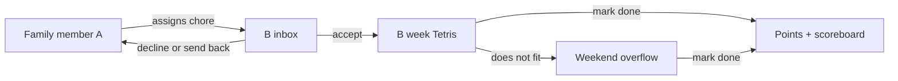
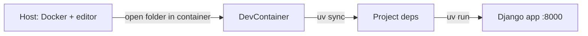

# Family chore planner

Funny for kids **without** random chance: the fun is scheduling, finishing, and the weekly scoreboard.

A Django + HTMX family chore app: people assign tasks to each other, the receiver can decline or send them back, then Tetris-fits Small/Medium/Large blocks into a week (overflow = weekend pile). Finishing earns points (more if someone else assigned it); a weekly scoreboard with silly titles is the joke.

## Locked decisions

- **No fate:** nobody spins or gets a random chore.
- **Assign:** anyone can send a chore to anyone. Receiver can **accept, decline, or send back**.
- **Self-assign is allowed**, but scores fewer points than a task someone else gave you.
- **Schedule:** after accept, you drag the task onto **your week** (others can see *when* you plan to do it).
- **Tetris:** days are boxes; tasks are **S / M / L** blocks. Leftovers go to a **weekend catch-up pile** (still Tetris), no shame score hit.
- **Points:** finish a task → points. Extra points if it was assigned by someone else.
- **Reward:** family **scoreboard**, weekly winner, **silly titles** (not spendable treats).
- **Tone:** playful colors/stickers/sounds; **chore names stay normal** (“Unload dishwasher”).
- **Accounts:** real logins, one shared household.
- **Stack:** [Django](https://www.djangoproject.com/) + HTMX, a little JS for drag-and-drop.
- **Dev environment:** [Dev Containers](https://containers.dev/) — open the repo in a container; do not install Python, `uv`, or project deps on the host.
- **Host prerequisites only:** Docker (e.g. Docker Desktop) + a Dev Containers–capable editor (Cursor/VS Code). Nothing else for the app stack.
- **Deps:** [`uv`](https://docs.astral.sh/uv/) inside the container (`pyproject.toml` + lockfile); no host `venv` / `pip`.

## How a week works

1. A writes a chore (normal name), picks **who**, picks **S/M/L**, sends it.
2. B sees it in an inbox → accept / decline / send back.
3. B drags accepted blocks onto Mon–Fri. Overflow sits in **Weekend**.
4. B marks done when finished. Household can see planned days and done/not done.
5. Week rolls: leftover weekend pile can slide forward (still overflow, not a penalty).

## Homework MVP (build this)

**Must have**

- Sign up / log in (Django auth). Create or join a household (simple **invite code**).
- Switch nothing: you are always “yourself”; you see the household.
- Create + assign tasks; inbox with accept / decline / send back.
- Personal week board: 5 weekday columns + weekend overflow; drag S/M/L blocks.
- Mark complete → points (self-assign vs other-assign multipliers, e.g. 1× vs 2×).
- Household scoreboard + weekly winner + a few silly titles from rank/points.
- Playful CSS; optional tiny sound on complete.

**Explicitly out of scope**

- Random assignment / spinning wheel.
- Spending points on real privileges.
- Cartoon chore-monsters or announcer copy.
- Native mobile apps, Google login, emails (unless Django needs a confirmation email you already know how to send).
- Chat, photos of completed work, recurring chore templates (nice later).

## Data (enough to implement)

- **User** + **Household** + membership.
- **Task:** name, size (S/M/L), assigner, assignee, status (`offered` / `accepted` / `declined` / `returned` / `done`), planned day (`mon`…`fri` / `weekend` / none).
- **Points ledger** per completion (so the multiplier is obvious).
- **Week** keyed by start date for the scoreboard.

## Technical sketch

- DevContainer image includes Python + `uv`; `postCreateCommand` (or equivalent) runs `uv sync`.
- Server-rendered Django templates; HTMX for inbox and “mark done”.
- Drag-and-drop: small JS (HTML5 drag or a tiny library) posting the new day to Django.
- SQLite for local/dev in-container (Postgres deferred unless needed later).
- Forward port `8000`; run with `uv run python manage.py runserver`.

## Implementation checklist

- [ ] DevContainer + `uv` project layout (`.devcontainer/`, `pyproject.toml`, lockfile); open in container and `uv sync`
- [ ] Django project: auth, household, invite code
- [ ] Assign tasks + inbox (accept / decline / send back)
- [ ] S/M/L Tetris week board + weekend overflow
- [ ] Completion points, weekly scoreboard, silly titles
- [ ] Playful CSS/stickers/optional complete sound

## What “done” looks like

Environment: clone → open in DevContainer → deps via `uv` → run the app with no host Python.

A family of 2–4 demo users can assign, reject, schedule, overflow to weekend, complete, and see a weekly winner — all in the browser, no random chore lottery.