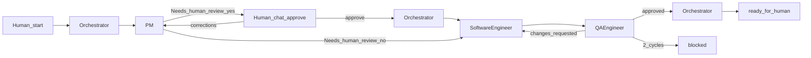

# Graph engineering process

Static multi-agent pipeline for Chore Master. Works with **any agentic client**: the Orchestrator starts a **fresh specialist run per node** (subagent, separate session, or that client’s equivalent isolation). Shared state lives on disk in a handoff file. Agents **never** `git commit`; the human commits/PRs after `ready_for_human`.

## Nodes

| Role | Playbook |
|------|----------|
| Orchestrator | [`_docs/team/orchestrator.md`](team/orchestrator.md) |
| Product Manager (PM) | [`_docs/team/pm.md`](team/pm.md) |
| Software Engineer | [`_docs/team/software-engineer.md`](team/software-engineer.md) |
| QA Engineer | [`_docs/team/qa-engineer.md`](team/qa-engineer.md) |

## Roles (summary)

- **PM** — grooms a task before anyone implements it; follows [`_docs/team/pm.md`](team/pm.md). May run **standalone** (human: “Groom backlog #N”) or as the **first node** of an implementation run.
- **Orchestrator** — creates the handoff, enforces gates, pauses for human when PM set **Needs human review: yes**.
- **Software Engineer** — implements from the groomed handoff with classic TDD.
- **QA Engineer** — checks finished work against acceptance criteria (and locks/scope); writes PASS/FAIL in **Review**.

## Grooming vs implementation

**Grooming** makes a backlog item precise enough that an engineer who never spoke to the PM could implement it. Shape: [`_docs/task-template.md`](task-template.md) — Goal, Acceptance criteria, Out of scope, Constraints.

- **Standalone:** Human asks the PM to groom. PM rewrites (or adds) a numbered item in [`_docs/backlog.md`](backlog.md) **in place**. No handoff. Human reviews the backlog entry.
- **Implementation graph:** Orchestrator creates a handoff, then PM runs first. PM checks that the backlog item already has enough detail to fill the handoff; if not, PM grooms it (and may add a new backlog item for ad-hoc work). Handoff always records **Backlog: #N**.

Catch misunderstandings while the issue is still a paragraph — correcting grooming is cheap; correcting after implementation is a rewrite.

## Graph

**Default path:** Orchestrator → PM → (human gate if PM groomed this turn) → Software Engineer → QA Engineer → Orchestrator sets `ready_for_human` → human.

**Cycles:**

- Human corrections after `pm_done` → Orchestrator re-runs **PM** with notes; pause again at `pm_done`.
- QA Engineer → Software Engineer when status is `changes_requested`.

**Cap:** After **2** `changes_requested` cycles (see `Review cycles`), Orchestrator sets `blocked` and pings the human. Do not start a third rework loop.

## How to start an implementation run

1. Human gives a **slug** and optional goal / backlog pointer (`#N`). Work may be a groomed backlog item or something not yet in the backlog (PM will add and groom it).
2. Orchestrator copies [`_docs/handoffs/_template.md`](handoffs/_template.md) to:

   `_docs/handoffs/YYYYMMDD-<slug>.md`

   Use the current date (`YYYYMMDD`) and the human’s slug (lowercase, hyphenated).
3. Status starts as `pending`.
4. Orchestrator starts **PM**, then follows gates below. Do **not** start Software Engineer while **Needs human review** is `yes` until the human approves in chat.

## How to groom only

1. Human asks to groom (e.g. “Groom backlog #4” or describes new work).
2. Agent follows [`_docs/team/pm.md`](team/pm.md) **standalone** mode — no Orchestrator handoff required.
3. Human reviews the backlog entry. Later implementation runs can skip the human gate when PM only copies an already-complete item (`Needs human review: no`).

## Specialist run rule

Each node run is a **fresh specialist agent** (isolated from prior role context as far as the client allows) that must:

1. Read its playbook under `_docs/team/`.
2. Read the handoff file for this run (graph mode).
3. Read [`_docs/plan.md`](plan.md) and [`_docs/backlog.md`](backlog.md) as needed — not from conversation memory alone.
4. Update only the handoff / backlog sections and statuses it is allowed to change.
5. Return a short summary to the Orchestrator when done.

Orchestrator must not implement features. Specialists must not skip gates.

Client adapters (how to spawn the run) are irrelevant to the graph: gates, statuses, and handoff files stay the same everywhere.

## Handoff file

**Path:** `_docs/handoffs/YYYYMMDD-<slug>.md`  
**Template:** [`_docs/handoffs/_template.md`](handoffs/_template.md)  
**Groomed shape:** [`_docs/task-template.md`](task-template.md)

### Required sections

1. **Status** (includes `Review cycles`, **Backlog**, **Needs human review**)
2. **Goal**
3. **Acceptance criteria**
4. **Out of scope**
5. **Constraints**
6. **Evidence**
7. **Review**

### Status values

| Status | Meaning |
|--------|---------|
| `pending` | Handoff created; PM not done |
| `pm_done` | Four groomed sections filled; if **Needs human review** is `yes`, Orchestrator pauses until human says go in chat; if `no`, ready for Software Engineer |
| `dev_done` | Implementation + Evidence complete; ready for QA Engineer |
| `changes_requested` | QA Engineer rejected (FAIL); Software Engineer must rework |
| `approved` | QA Engineer accepted (PASS); Orchestrator must finalize |
| `blocked` | Stopped (e.g. 2 failed review cycles); human must intervene |
| `ready_for_human` | Graph finished; human may commit/PR |

### Who may set which status

| From | To | Who |
|------|----|-----|
| (new file) | `pending` | Orchestrator |
| `pending` | `pm_done` | PM |
| `pm_done` → `pending` (re-groom) | Orchestrator (on human correction notes), then PM → `pm_done` again |
| `pm_done` or `changes_requested` | `dev_done` | Software Engineer |
| `dev_done` | `approved` | QA Engineer |
| `dev_done` | `changes_requested` | QA Engineer (also increments `Review cycles`) |
| `approved` | `ready_for_human` | Orchestrator |
| any (after 2 review cycles) | `blocked` | Orchestrator |

### Gates (Orchestrator enforces)

| Next node | Required status | Required content |
|-----------|-----------------|------------------|
| PM | `pending` | Handoff file exists from template |
| Human (chat) | `pm_done` and **Needs human review:** `yes` | Ping human with handoff path; wait for approve or correction notes |
| Software Engineer | `pm_done` with **Needs human review:** `no`, or `pm_done` after human approve, or `changes_requested` | Goal + Acceptance criteria + Out of scope + Constraints filled; **Backlog** set; if rework, Review explains what failed |
| QA Engineer | `dev_done` | Status `dev_done` (QA re-runs tests; Evidence may be incomplete) |
| Orchestrator finalize | `approved` | Review records `## QA: PASS` |
| Stop / ping human | `Review cycles` ≥ 2 after a new `changes_requested`, or explicit `blocked` | — |

### Human gate after PM

- Status stays **`pm_done`** while paused (no separate status).
- Human replies in **chat** (not by editing the handoff).
- **Approve** → Orchestrator starts Software Engineer (may set **Needs human review** to `no` when recording the go-ahead).
- **Corrections** → Orchestrator sets Status back to `pending`, re-runs PM with the notes; PM updates backlog + handoff, sets `pm_done` with **Needs human review: yes** again; Orchestrator pauses again.

### Review cycles

- Field lives under **Status** in the handoff: `Review cycles: N` (starts at `0`).
- QA Engineer increments by **1** each time it sets `changes_requested`.
- When QA Engineer would request changes and `Review cycles` would become **greater than 2**, Orchestrator instead sets `blocked` and pings the human (do not launch a third Dev pass). Practical rule: after the **second** `changes_requested`, Orchestrator sets `blocked` and does not relaunch Software Engineer.

## Software Engineer TDD (summary)

Full rules: [`_docs/team/software-engineer.md`](team/software-engineer.md).

- Classic **red → green → refactor**; no production behavior change without a failing test first.
- Mandatory tests: Django model + view/HTMX tests via test client — **no** browser e2e for this process.
- Stay inside handoff **Constraints** and **Out of scope**.
- Before `dev_done`, paste into **Evidence**:
  - Output of `uv run python manage.py test` (full suite, green)
  - Migrate check (e.g. show migrations applied / no pending)

## Exit

- **`ready_for_human`:** Orchestrator tells the human the handoff path; human commits/PRs. Agents must **not** run `git commit` / push / open PRs unless the human explicitly asks outside this graph.
- **`blocked`:** Orchestrator stops and pings the human with why (usually review-cycle cap).

## Product context

Do not duplicate product locks here. Agents read [`_docs/plan.md`](plan.md) and [`_docs/backlog.md`](backlog.md) as needed.
