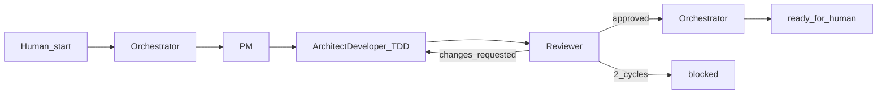

# Graph engineering process

Static multi-agent pipeline for Chore Master. Works with **any agentic client**: the Orchestrator starts a **fresh specialist run per node** (subagent, separate session, or that client’s equivalent isolation). Shared state lives on disk in a handoff file. Agents **never** `git commit`; the human commits/PRs after `ready_for_human`.

## Nodes

| Role | Playbook |
|------|----------|
| Orchestrator | [`_docs/team/orchestrator.md`](team/orchestrator.md) |
| Product Manager (PM) | [`_docs/team/pm.md`](team/pm.md) |
| Architect-Developer-TDD | [`_docs/team/architect-developer.md`](team/architect-developer.md) |
| Reviewer | [`_docs/team/reviewer.md`](team/reviewer.md) |

## Graph

**Default path:** Orchestrator → PM → Architect-Developer-TDD → Reviewer → Orchestrator sets `ready_for_human` → human.

**Only cycle:** Reviewer → Architect-Developer when status is `changes_requested`.

**Cap:** After **2** `changes_requested` cycles (see `Review cycles`), Orchestrator sets `blocked` and pings the human. Do not start a third rework loop.

## How to start a run

1. Human gives a **slug** (and optional goal / backlog pointer). Work is **not** required to match a backlog number.
2. Orchestrator copies [`_docs/handoffs/_template.md`](handoffs/_template.md) to:

   `_docs/handoffs/YYYYMMDD-<slug>.md`

   Use the current date (`YYYYMMDD`) and the human’s slug (lowercase, hyphenated).
3. Status starts as `pending`.
4. Human does not approve between nodes; Orchestrator runs PM → Dev → Reviewer back-to-back via specialist runs until `ready_for_human` or `blocked`.

## Specialist run rule

Each node run is a **fresh specialist agent** (isolated from prior role context as far as the client allows) that must:

1. Read its playbook under `_docs/team/`.
2. Read the handoff file for this run.
3. Read [`_docs/plan.md`](plan.md) (and backlog if relevant) for product locks — not from conversation memory alone.
4. Update only the handoff sections and statuses it is allowed to change.
5. Return a short summary to the Orchestrator when done.

Orchestrator must not implement features. Specialists must not skip gates.

Client adapters (how to spawn the run) are irrelevant to the graph: gates, statuses, and handoff files stay the same everywhere.

## Handoff file

**Path:** `_docs/handoffs/YYYYMMDD-<slug>.md`  
**Template:** [`_docs/handoffs/_template.md`](handoffs/_template.md)

### Required sections

1. **Status** (includes `Review cycles`)
2. **Goal**
3. **Acceptance criteria**
4. **Evidence**
5. **Review**

### Status values

| Status | Meaning |
|--------|---------|
| `pending` | Handoff created; PM not done |
| `pm_done` | Goal + acceptance criteria filled; ready for Architect-Developer |
| `dev_done` | Implementation + Evidence complete; ready for Reviewer |
| `changes_requested` | Reviewer rejected; Architect-Developer must rework |
| `approved` | Reviewer accepted; Orchestrator must finalize |
| `blocked` | Stopped (e.g. 2 failed review cycles); human must intervene |
| `ready_for_human` | Graph finished; human may commit/PR |

### Who may set which status

| From | To | Who |
|------|----|-----|
| (new file) | `pending` | Orchestrator |
| `pending` | `pm_done` | PM |
| `pm_done` or `changes_requested` | `dev_done` | Architect-Developer |
| `dev_done` | `approved` | Reviewer |
| `dev_done` | `changes_requested` | Reviewer (also increments `Review cycles`) |
| `approved` | `ready_for_human` | Orchestrator |
| any (after 2 review cycles) | `blocked` | Orchestrator |

### Gates (Orchestrator enforces)

| Next node | Required status | Required content |
|-----------|-----------------|------------------|
| PM | `pending` | Handoff file exists from template |
| Architect-Developer | `pm_done` or `changes_requested` | Goal + Acceptance criteria filled; if rework, Review explains what failed |
| Reviewer | `dev_done` | Evidence includes full test run + migrate check |
| Orchestrator finalize | `approved` | Review records approval |
| Stop / ping human | `Review cycles` ≥ 2 after a new `changes_requested`, or explicit `blocked` | — |

### Review cycles

- Field lives under **Status** in the handoff: `Review cycles: N` (starts at `0`).
- Reviewer increments by **1** each time it sets `changes_requested`.
- When Reviewer would request changes and `Review cycles` would become **greater than 2**, Orchestrator instead sets `blocked` and pings the human (do not launch a third Dev pass). Practical rule: after the **second** `changes_requested`, Orchestrator sets `blocked` and does not relaunch Architect-Developer.

## Architect-Developer TDD (summary)

Full rules: [`_docs/team/architect-developer.md`](team/architect-developer.md).

- Classic **red → green → refactor**; no production behavior change without a failing test first.
- Mandatory tests: Django model + view/HTMX tests via test client — **no** browser e2e for this process.
- Before `dev_done`, paste into **Evidence**:
  - Output of `uv run python manage.py test` (full suite, green)
  - Migrate check (e.g. show migrations applied / no pending)

## Exit

- **`ready_for_human`:** Orchestrator tells the human the handoff path; human commits/PRs. Agents must **not** run `git commit` / push / open PRs unless the human explicitly asks outside this graph.
- **`blocked`:** Orchestrator stops and pings the human with why (usually review-cycle cap).

## Product context

Do not duplicate product locks here. Agents read [`_docs/plan.md`](plan.md) and [`_docs/backlog.md`](backlog.md) as needed.
